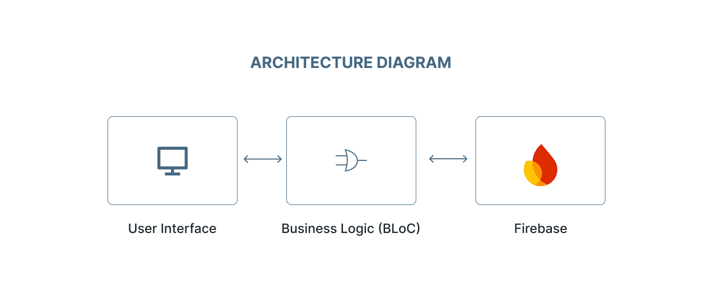

# Flutter Notes App

A simple yet robust note-taking application built with Flutter, Firebase Authentication, and Firestore. It uses the **BLoC (Business Logic Component)** pattern for state management, ensuring a clear separation of concerns, testability, and scalability.

---

## Features

* **User Authentication**: Secure sign-up and sign-in using email and password via Firebase Authentication.
* **Persistent Notes**: Create, read, update, and delete notes stored securely in Firebase Firestore.
* **Real-time Updates**: Notes sync in real time across devices using Firestore’s live data streams.
* **User-Specific Data**: Each user can only access their own notes, enforced via Firestore Security Rules.
* **Responsive UI**: Optimized to work on different screen sizes.
* **Password Visibility Toggle**: Option to show/hide password for better usability.
* **Delete Confirmation**: Prevent accidental deletion with a confirmation dialog.
* **Input Validation**: Client-side validation on login and sign-up forms.

---

## Architecture Diagram



---

## Getting Started

### Prerequisites

* **Flutter SDK**: Version 3.x.x or higher
* **Firebase CLI**
* **Android Studio or VS Code**: With Flutter and Dart plugins installed
* **Node.js and npm**: Required for Firebase CLI

---

### 1. Clone the Repository

```bash
git clone https://github.com/dianepretty/flutter-notes.git
```

---

### 2. Firebase Project Setup

This app depends on Firebase for authentication and cloud storage.

#### a. Create a Firebase Project

1. Visit the [Firebase Console](https://console.firebase.google.com/).
2. Click **"Add project"** and follow the instructions.

#### b. Add Flutter App to Firebase

1. In your Firebase project, click the **Flutter icon** (or "Add app" → choose Flutter).
2. Follow instructions to install Firebase CLI and FlutterFire CLI.
3. From your Flutter project root directory, run:

```bash
flutterfire configure
```

#### c. Enable Authentication Methods

1. In Firebase Console → go to **Authentication** under "Build".
2. Navigate to the **"Sign-in method"** tab.
3. Enable the **"Email/Password"** provider.

#### d. Set Up Firestore Database

1. In Firebase Console → go to **Firestore Database** under "Build".
2. Click **"Create database"**.
3. Select **"Start in production mode"** and choose your preferred location.

---

### 3. Install Dependencies

From the root directory of your project, run:

```bash
flutter pub get
```

---

### 4. Run the Application

Connect a device or start an emulator, then run:

```bash
flutter run
```

